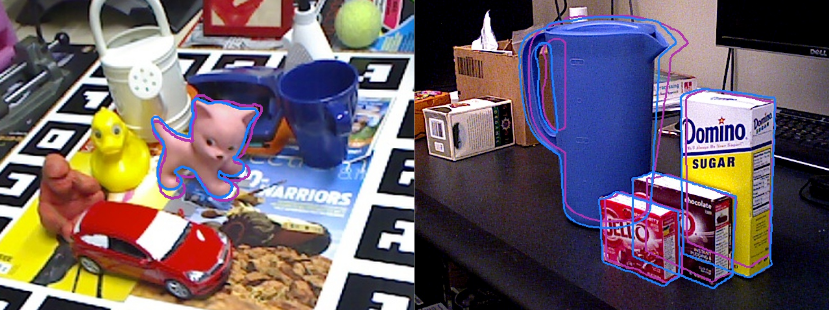
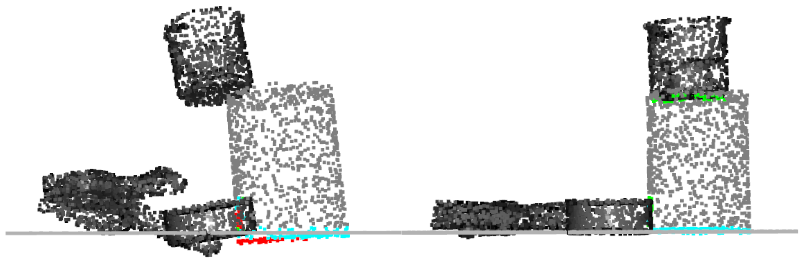

# SporeAgent: Reinforced Scene-level Plausibility for Object Pose Refinement
This repository implements the approach described in *SporeAgent: Reinforced Scene-level Plausibility for Object Pose 
Refinement* ([WACV 2022](https://openaccess.thecvf.com/content/WACV2022/html/Bauer_SporeAgent_Reinforced_Scene-Level_Plausibility_for_Object_Pose_Refinement_WACV_2022_paper.html), [arXiv](https://arxiv.org/abs/2201.00239)).




_Iterative registration using SporeAgent:\
The initial pose from PoseCNN (purple) and the final pose using SporeAgent (blue) on the LINEMOD (left,cropped) and 
YCB-Video (right) datasets._ 



_Scene-level Plausibility:\
The initial scene configuration from PoseCNN (left) results in an implausible pose of the 
target object (gray). Refinement using SporeAgent (right) results in a plausible scene configuration where the 
intersecting points (red) are resolved and the object rests on its supported points (cyan)._

| LINEMOD              | AD < 0.10d | AD < 0.05d | AD <0.02d | YCB-Video| ADD AUC | AD AUC | ADI AUC |
|----------------------|:----------:|:----------:|:---------:|----------|:-------:|:------:|:-------:|
| PoseCNN              |    62.7    |    26.9    |    3.3    |          |   51.5  |  61.3  |   75.2  |
| Point-to-Plane ICP   |    92.6    |    79.8    |    29.9   |          |   68.2  |  79.2  |   87.8  |
| w/ VeREFINE          |    96.1    |    85.8    |    32.5   |          |   70.1  |  81.0  |   88.8  |
| Multi-hypothesis ICP |  **99.3**  |    89.9    |    35.6   |          |   77.4  |  86.6  |   92.6  |
| **SporeAgent**       |  **99.3**  |  **93.7**  |  **50.3** |          | **79.0**|**88.8**| **93.6**|

_Comparison on LINEMOD and YCB-Video:\
The initial pose and segmentation estimates are computed using PoseCNN. We compare our approach to vanilla Point-to-Plane 
ICP (from Open3D), Point-to-Plane ICP augmented by the simulation-based [VeREFINE](https://github.com/dornik/verefine) 
approach and the ICP-based multi-hypothesis approach used for refinement in PoseCNN._

### Dependencies
The code has been tested on Ubuntu 16.04 and 20.04 with Python 3.6 and CUDA 10.2. To set-up the Python environment, use 
Anaconda and the provided YAML file:

`conda env create -f environment.yml --name sporeagent`

`conda activate sporeagent`.

The [BOP Toolkit](https://github.com/thodan/bop_toolkit/tree/master/) is additionally required. The `BOP_PATH` in 
`config.py` needs to be changed to the respective clone directory and the packages required by the BOP Toolkit need to 
be installed.

The [YCB-Video Toolbox](https://github.com/yuxng/YCB_Video_toolbox/) is required for experiments on the YCB-Video 
dataset.

## Datasets
We use the dataset versions prepared for the [BOP challenge](https://bop.felk.cvut.cz/datasets/). The required files 
can be downloaded to a directory of your choice using the following bash script:

```bash
export SRC=http://ptak.felk.cvut.cz/6DB/public/bop_datasets
export DATASET=ycbv                     # either "lm" or "ycbv"
wget $SRC/$DATASET_base.zip             # Base archive with dataset info, camera parameters, etc.
wget $SRC/$DATASET_models.zip           # 3D object models.
wget $SRC/$DATASET_test_all.zip         # All test images.
unzip $DATASET_base.zip                 # Contains folder DATASET.
unzip $DATASET_models.zip -d $DATASET   # Unpacks to DATASET.
unzip $DATASET_test_all.zip -d $DATASET # Unpacks to DATASET.
```

For training on YCB-Video, the `$DATASET_train_real.zip` is moreover required.

In addition, we have prepared point clouds sampled within the ground-truth masks (for training) and the segmentation 
masks computed using PoseCNN (for evaluation) for the [LINEMOD](https://owncloud.tuwien.ac.at/index.php/s/AK9uJVz37cJ8tEr) 
and [YCB-Video](https://owncloud.tuwien.ac.at/index.php/s/92jqBYCw6pI0vgU) dataset. 
The samples for evaluation also include the initial pose estimates from PoseCNN.

### LINEMOD
Extract the prepared samples into `PATH_TO_BOP_LM/sporeagent/` and set `LM_PATH` in `config.py` to the base directory, 
i.e., `PATH_TO_BOP_LM`. Download the [PoseCNN results](https://drive.google.com/file/d/1eayZ5sZBim-AQwBF_7nRl-tfAoTo5pHX/view?usp=sharing) 
and the corresponding [image set definitions](https://drive.google.com/file/d/12vOxODOzspJKQFJLQ-dXfuC4fANvqarb/view?usp=sharing) 
provided with DeepIM and extract both into `POSECNN_LM_RESULTS_PATH`. Finally, since the BOP challenge uses a different 
train/test split than the compared methods, the appropriate target file found [here](https://owncloud.tuwien.ac.at/index.php/s/tL1ZGzW2pJSflHy) 
needs to be placed in the `PATH_TO_BOP_LM` directory.

To compute the AD scores using the BOP Toolkit, `BOP_PATH/scripts/eval_bop19.py` needs to be adapted:
- to use ADI for symmetric objects and ADD otherwise with a 2/5/10% threshold, change `p['errors']` to 
```
{
  'n_top': -1,
  'type': 'ad',
  'correct_th': [[0.02], [0.05], [0.1]]
}
```
- to use the correct test targets, change `p['targets_filename']` to `'test_targets_add.json'`

### YCB-Video
Extract the prepared samples into `PATH_TO_BOP_YCBV/sporeagent/` and set `YCBV_PATH` in `config.py` to the base directory, 
i.e., `PATH_TO_BOP_YCBV`. Clone the [YCB Video Toolbox](https://github.com/yuxng/YCB_Video_toolbox) to 
`POSECNN_YCBV_RESULTS_PATH`. Extract the `results_PoseCNN_RSS2018.zip` and copy [`test_data_list.txt`](https://owncloud.tuwien.ac.at/index.php/s/tVOCv0iF08LLYo5) 
to the same directory. The `POSECNN_YCBV_RESULTS_PATH` in `config.py` needs to be changed to the respective directory. 
Additionally, place the meshes in the canonical frame [`models_eval_canonical`](https://owncloud.tuwien.ac.at/index.php/s/kH0vfocerlHOWrO) 
in the `PATH_TO_BOP_YCBV` directory.

To compute the ADD/AD/ADI AUC scores using the YCB-Video Toolbox, replace the respective files in the toolbox by the 
ones provided in `sporeagent/ycbv_toolbox`. 

### Pretrained models
`Important notice: Previously, by mistake, the weights from the *first* epoch (instead of 100) were provided here. If you downloaded them before May 22, 2024, please replace the weights with the corrected versions below.`

Weights for both datasets can be found [here](https://drive.google.com/drive/folders/1v95GmTvQp10SA4nmNtSsxRWPanKwYI38?usp=sharing). Download and 
copy them to `sporeagent/weights/`.

## Training
For LINEMOD: `python registration/train.py --dataset=lm`

For YCB-Video: `python registration/train.py --dataset=ycbv`

## Evaluation
Note that we precompute the normal images used for pose scoring on the first run and store them to disk.

### LINEMOD
The results for LINEMOD are computed using the BOP Toolkit. The evaluation script exports the required file by running

`python registration/eval.py --dataset=lm`,

which can then be processed via

`python BOP_PATH/scripts/eval_bop19.py --result_filenames=PATH_TO_CSV_WITH_RESULTS`.

### YCB-Video
The results for YCB-Video are computed using the YCB-Video Toolbox. The evaluation script exports the results in BOP 
format by running

`python registration/eval.py --dataset=ycbv`,

which can then be parsed into the format used by the YCB-Video Toolbox by running

`python utility/parse_matlab.py`.

In MATLAB, run `evaluate_poses_keyframe.m` to generate the per-sample results and `plot_accuracy_keyframe.m` to compute 
the statistics.

## Citation
If you use this repository in your publications, please cite

```
@article{bauer2022sporeagent,
    title={SporeAgent: Reinforced Scene-level Plausibility for Object Pose Refinement},
    author={Bauer, Dominik and Patten, Timothy and Vincze, Markus},
    booktitle={IEEE/CVF Winter Conference on Applications of Computer Vision (WACV)},
    year={2022},
    pages={654-662}
}
```
